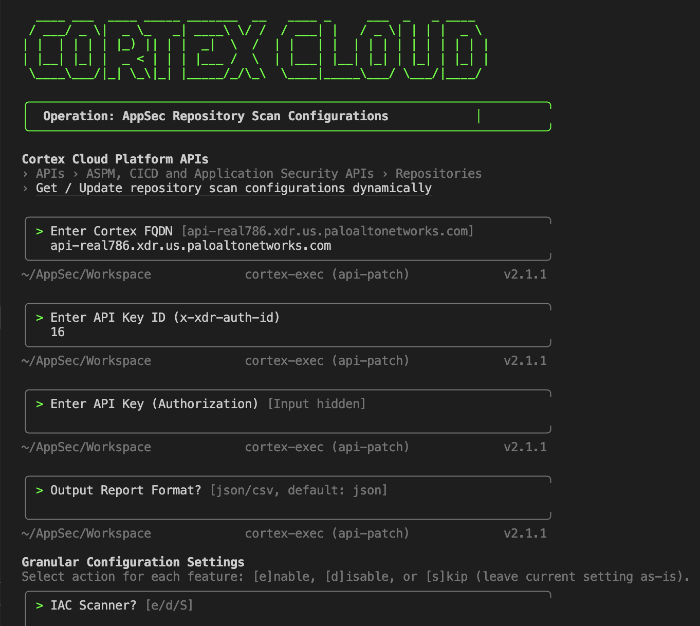

# 🛡️ Cortex Cloud AppSec - Repository Scan Configurations

Interactive Bash CLI utility designed to perform targeted, patch updates to repository scan configurations in Cortex Cloud (AppSec).

This utility dynamically reads (`GET`) the existing configuration for each repository, applies a targeted `jq` patch based on your granular inputs, and safely updates (`PUT`) the configuration back to Cortex Cloud—all while respecting API rate limits and maintaining a resumable local state.

## 📸 Visual Preview


*Scan Config interactive execution*

## ✨ Features

* 🎯 **Dynamic Targeting:** Apply updates globally, or use Regex to target specific repositories (e.g., `^frontend-`) or exclude others (e.g., `-legacy$`).
* 🩹 **Patching:** Granularly `[e]`nable, `[d]`isable, or `[s]`kip (leave as-is) individual scanners like IAC, SCA, Secrets, Deep Git History, and PR Scanning.
* 💾 **Stateful Execution:** Automatically saves progress to a local checkpoint. If the script is interrupted, or if you run into network issues, it can seamlessly resume right where it left off.
* 🚦 **Rate Limits:** Built-in exponential backoff automatically handles API rate limits (HTTP 429) and transient server errors (HTTP 5xx).
---

## 📦 Dependencies

This script requires two standard command-line tools:
1. `curl` (For API communication)
2. `jq` (For dynamic JSON parsing and patching)

**Installation:**
* **macOS:** `brew install jq curl`
* **Ubuntu/Debian:** `sudo apt-get update && sudo apt-get install jq curl`
* **RHEL/CentOS:** `sudo yum install jq curl`

---

## 🔐 Authentication & Configuration

The script interacts with the Cortex Cloud APIs. You will need an API Key and Key ID. 
* 📚 [How to get your FQDN](https://docs-cortex.paloaltonetworks.com/r/Cortex-Cloud-Platform-APIs/Get-your-FQDN)
* 📚 [How to generate an API Key & ID](https://docs-cortex.paloaltonetworks.com/r/Cortex-Cloud-Platform-APIs/Create-a-new-API-key)

**Option A: Environment Variables (Recommended for CI/CD or secure execution)**
You can export these variables in your terminal before running the script to bypass the interactive prompts:
```bash
export CORTEX_FQDN="api-real786.xdr.us.paloaltonetworks.com"
export CORTEX_API_KEY_ID="your-api-key-id-here"
export CORTEX_API_KEY="your-secure-api-key-here"
```

**Option B: Interactive Prompts**
If the environment variables are not detected, the CLI will securely prompt you for them. *(Note: The API Key input is hidden from the terminal screen).*

---

## 🚀 Usage

1. Save the script as `cortex_appsec_patcher.sh`.
2. Make it executable:
   ```bash
   chmod +x cortex_appsec_patcher.sh
   ```
3. Execute the script:
   ```bash
   .scan_config.sh
   ```

### Execution Phases:
1. **Configuration Phase:** You will be asked to select `[e]nable`, `[d]isable`, or `[s]kip` for each scanning feature.
2. **Targeting Phase:** You will choose whether to apply these settings **Globally**, by **Include Regex**, or by **Exclude Regex**.
3. **Execution Phase:** The script will process repositories in batches of 20, gracefully pausing to respect Cortex Cloud rate limits.
4. **Reporting Phase:** A final summary will be printed, and a detailed audit log (`JSON` or `CSV`) will be saved to your working directory.

---

## 📁 Artifacts & State Management

* **`.cortex_checkpoint.log`**: A hidden temporary file used to track successfully updated repositories. If you re-run the script with an existing checkpoint, it will ask if you want to **Resume** or **Start Fresh**.
* **`cortex_appsec_audit_YYYY-MM-DD_HH-MM-SS.json`**: The final execution report detailing the exact `AssetID`, `Status`, and `HTTP_Code` of every processed repository.

---

## ⚠️ Troubleshooting

| HTTP Status | Meaning & Script Behavior |
| :--- | :--- |
| **401 / 403** | **Unauthorized.** Your API Key or Key ID is invalid. The script will immediately abort. |
| **422** | **Unprocessable Entity.** Usually caused by strict schema validation (e.g., trying to `PUT` a read-only field like `validateSecrets`). The script safely catches this, logs the API error reason to your console, and continues processing the remaining batch. |
| **429** | **Too Many Requests.** You hit the API rate limit. The script will automatically pause and retry using exponential backoff. |
| **5xx** | **Server Error.** Cortex Cloud is experiencing transient issues. The script will automatically pause and retry. |