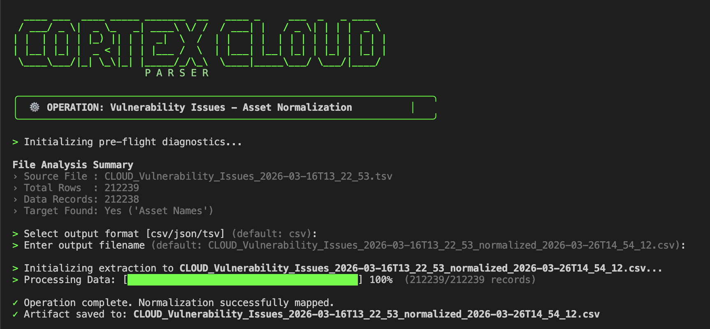

# ⚙️ Cortex Cloud Asset Parser (v0.1)

> **Container Asset Extraction & Normalization**

The **Cortex Cloud Asset Parser** is a high-performance, stream-oriented Bash utility designed to parse, and normalize Asset Name Column values extracted from Cortex cloud exported TSV files. It intelligently parses complex, array-based image registry strings into highly structured data columns without exhausting system memory.

## 📸 Visual Preview


*Cortex Cloud Asset Parser interactive execution and progress telemetry.*

---

## 🚀 Features

* **Memory-Safe Streaming:** Utilizes an embedded `awk` processing engine capable of handling multi-gigabyte files without loading the entire dataset into RAM.
* **Dynamic Schema Detection:** Automatically locates the `Asset Names` column regardless of its index position.
* **Intelligent String Parsing:** Safely extracts Repository, Image Name, and Image Version from complex strings (e.g., `['registry.svc:5000/repo/image:v110']`), automatically handling brackets, quotes, and whitespace.
* **Multi-Format Output:** Natively supports structured output to `CSV`, `TSV`, and fully escaped `JSON` architectures.
* **Interactive Telemetry:** Features a dynamic, percentage-based progress bar for real-time observability during large extraction operations.
* **Smart Artifact Generation:** Automatically generates collision-resistant output filenames appending `_normalized_` and an ISO-8601 timestamp (e.g., `data_normalized_2026-03-26T11_52_03.csv`).

---

## 📋 Prerequisites

This script relies strictly on POSIX-compliant standard Unix tools. No external dependencies or package installations (like Python or Node.js) are required.

* **OS:** Linux, macOS, or Windows (via WSL or Git Bash)
* **Shell:** `bash` (Version 3.2+ supported)
* **Core Utilities:** `awk`, `grep`, `wc`, `date`

### 🪟 Windows Users (Critical Note)
This script requires a Bash environment. You **cannot** run this natively in `cmd.exe` or standard PowerShell.
1. Run via **WSL (Windows Subsystem for Linux)** or **Git Bash**.
2. **Line Endings:** Ensure the script is saved with Unix line endings (`LF` / `\n`), **not** Windows line endings (`CRLF` / `\r\n`). If you encounter syntax errors immediately upon execution, run `dos2unix cortex-parser.sh` to fix the file encoding.

---

## 💻 Execution & Usage

### Step 1: Grant Execution Permissions
Before running the script for the first time, you must make it executable. Open your terminal and run:
```bash
chmod +x cortex-parser.sh
```

### Step 2: Run the Tool (Interactive Mode)
Pass your exported TSV file to the script as an argument. The interactive wizard will launch and prompt you for output preferences:

```Bash
./cortex-parser.sh CLOUD_Vulnerability_Issues_2026-03-16T13_22_53.tsv
```